<h1 align="center">Hi there! I am Aishik Mukherjee 👋🏼</h1>

  

  A highly motivated Pythonista and a DataOps developer, linux enthusiast with a keen interest in backend development. Creative mindset paired with out of the box thinking capabilities allowing development of robust solutions 🪄.

<h2 align="center">ABOUT ME</h2>
<ul align="left">
  <li>💫 Passionate DataOps developer who loves to build and maintain scalable and reliable data analytics systems.</li>
  <li>🖥️ Linux enthusiast maintaining a debian home-server, capable of data storage, media streaming, VPN among other services.</li>
  <li>🗃️ Ex-Android ROM/Kernel dev.</li>
  <li>📖 Interested in Machine Learning.</li>
  <li>🌈 Fun fact: I like traveling to remote places. It helps me to relax and reduce burnout.</li>
</ul>

  Listening to:
   
  

<h2 align="center">CONTACT ME</h2>

  
  
  
  

<h2 align="center">MY CONTRIBUTIONS</h2>

  
   
  
   
  

  
  <em>
    <b>I love interacting and collaborating with people. So feel free to connect with me</b> 😃
  </em>

